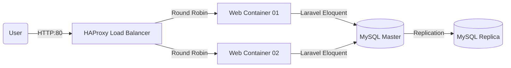

Claro, aquí tienes el texto convertido a formato **Markdown**, manteniendo la estructura y estilo:

---

# ✈️ Travel Agency - High Availability System

**Course:** IT Service Management
**Project:** High Availability Web System Prototype

---

## 📖 Project Description

This project involves the development of a comprehensive web platform for travel booking management (flights, buses, and hotels). The core objective is not only the web application itself but the High Availability (HA) infrastructure supporting it.

The system implements a distributed hybrid architecture using Virtual Machines (Ubuntu Server) and Docker Containers, orchestrated to ensure continuous service through load balancing and data replication.

---

## 🏗️ System Architecture

The infrastructure is deployed across three nodes (VMs) connected via a private internal network (Host-Only Adapter):

### Network Topology

| Node  | Role                | Static IP     | Description                                                              |
| ----- | ------------------- | ------------- | ------------------------------------------------------------------------ |
| VM-01 | App Host & Balancer | 192.168.56.10 | Runs Docker. Hosts the HAproxy load balancer and Laravel app containers. |
| VM-02 | DB Master           | 192.168.56.20 | Native MySQL server. Handles critical writes and reads.                  |
| VM-03 | DB Replica          | 192.168.56.21 | Native MySQL server (Mirror). Real-time replica of the master.           |

### Architecture Diagram



---

## 🛠️ Tech Stack

**Backend:** PHP 8.2, Laravel 11
**Frontend:** Blade Templates, Tailwind CSS, Laravel Breeze (Authentication)
**Database:** MySQL 8.0 (Master-Slave Configuration)

**Infrastructure:**

* VirtualBox
* Ubuntu Server 22.04 LTS
* Docker & Docker Compose
* HAProxy
* Netplan

---

## 🚀 Installation Guide (For Developers)

If you are part of the team and have just cloned this repository, follow these steps to set up the environment on your VM-01.

### Prerequisites

* All 3 VMs must be imported and configured with their static IPs.
* VM-02 (Master) must be running MySQL.

### Deployment Steps

#### 1️⃣ Clone the repository

```bash
git clone https://github.com/YOUR_USERNAME/REPO_NAME.git agencia-viajes
cd agencia-viajes
```

#### 2️⃣ Configure the environment (`.env`)

The `.env` file is not tracked. Duplicate the example:

```bash
cp src/.env.example src/.env
nano src/.env
```

Add:

```
DB_CONNECTION=mysql
DB_HOST=192.168.56.20
DB_PORT=3306
DB_DATABASE=agencia_viajes_db
DB_USERNAME=app_user
DB_PASSWORD=1234
SESSION_DRIVER=database
```

#### 3️⃣ Start the infrastructure (Docker)

```bash
docker compose up -d --build
```

#### 4️⃣ Install Dependencies

```bash
# Install PHP dependencies
docker compose exec web01 composer install

# Generate app key
docker compose exec web01 php artisan key:generate

# Install Node and compile assets
docker compose exec web01 npm install
docker compose exec web01 npm run build

# Run migrations
docker compose exec web01 php artisan migrate
```

---

### ✔️ Access the Application

Open from host browser:

```
http://192.168.56.10
```

---

## 🔌 API Endpoints

### Get Flights

```
GET /api/vuelos
```

**Response:** JSON Array containing the list of available flights.

---

## 👥 Authors

* **Sebastian Duran** – 23110319
* **Miriam Ulloa** – 23110011

Project developed for the **IT Service Management** course – 2025

---
